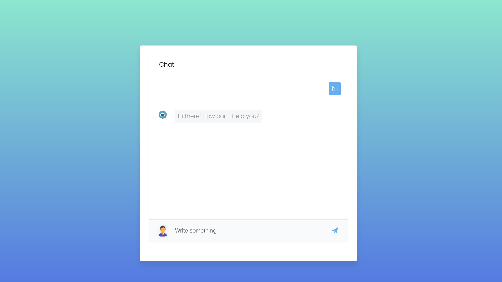

# The Chat GPT with no-brain

A Chat-bot that reply your question and calculations 


## Technical Details:-

####  Languages : 
`Python3` `HTML5` `CSS3` `JavaScript`

#### Frameworks :
`Flask` `Bootstrap 4`
## Installation

`Fork` the repository, this will make a copy of this project in your account.

Clone the repository by running below command

```bash
https://github.com/gandhiharsh082/chat_bot-.git](https://github.com/gandhiharsh082/chat_bot.git
```

Open the folder by running below command

```bash
cd chat_bot
```

Install dependencies

```bash
pip install -r requirements.txt
```

Run app.py using below command to start Flask API

```bash
python app.py
```

Note:- You must be on python version 3.

Navigate to URL "http://localhost:5000/"
- Now, You should be able to view the chat page.


## API Reference

#### OPEN AI

```http
  POST Request
```

| Parameter | Type     | Description                |
| :-------- | :------- | :------------------------- |
| `api_key` | `string` | **Required**. Your API key |
| `model` | `string` |total tokens must be below the model’s maximum limit |
| `temperature` | `interger` |Setting temperature to 0 will make the outputs mostly deterministic, but a small amount of variability may remain |
| `max_tokens` | `interger` |The model is better at inserting longer completions|
| `top_p` | `interger` |The "top_p" parameter is particularly useful for controlling the randomness and fluency of the generated text|
| `frequency_penalty` | `interger` |It allows you to adjust the model's tendency to reuse certain words or phrases|

its return string in object


#### Screenshot 



